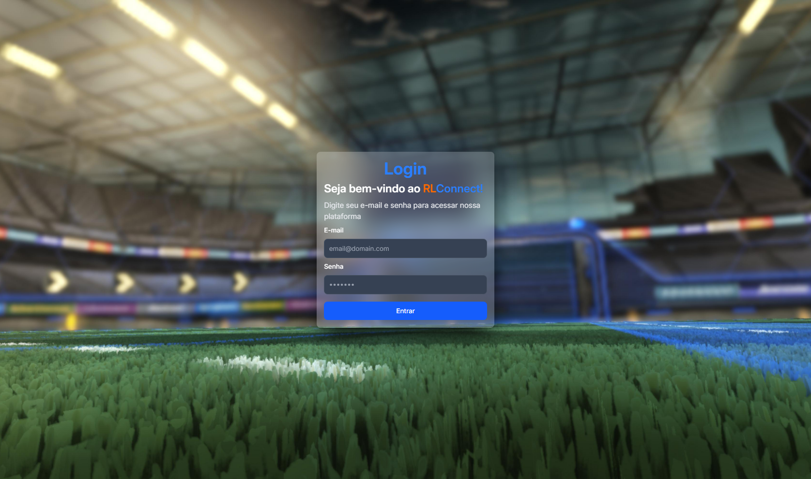
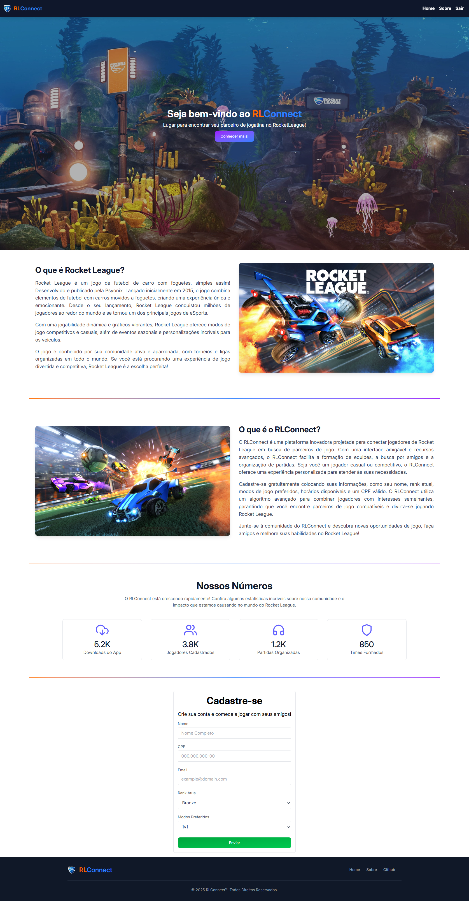

# 🚀 RLConnect

**RLConnect** é uma plataforma web desenvolvida com o objetivo de **conectar jogadores de Rocket League** em busca de parceiros de jogo, promovendo partidas mais divertidas e equilibradas.

Este projeto foi criado como parte da disciplina de **Programação de Scripts**, ministrada pelo professor [**Eloy**](https://github.com/JuniorEloy), e tem como foco a aplicação prática de conceitos de HTML, UI/UX e JavaScript na construção de interfaces interativas, funcionais e responsivas.

Com uma interface amigável e recursos inteligentes, o RLConnect permite:

-   A **formação de equipes**
-   A **busca por amigos**
-   E a **organização de partidas** multiplayer com base em preferências compatíveis

Seja você um jogador **casual** ou **competitivo**, o RLConnect oferece uma experiência personalizada que se adapta ao seu perfil e seus horários disponíveis.

---

## 🎮 O que o RLConnect oferece?

-   Cadastro gratuito com informações como:

    -   Nome
    -   CPF válido para garantir autenticidade
    -   E-mail
    -   Rank atual
    -   Modos de jogo preferidos

-   **Algoritmo de matchmaking** inteligente para encontrar jogadores com perfis compatíveis.

-   Interface responsiva e intuitiva, ideal para qualquer tipo de jogador.

---

## 📸 Capturas de Tela

### Página Inicial



### Tela de Login



---

## 🔧 Tecnologias Utilizadas

| Tecnologia   | Descrição                            |
| ------------ | ------------------------------------ |
| HTML5        | Estruturação das páginas             |
| Tailwind CSS | Estilização moderna e responsiva     |
| JavaScript   | Interatividade e lógica do front-end |
| Vercel       | Hospedagem da aplicação              |

---

## 📱 Responsividade

O RLConnect foi desenvolvido com foco na **experiência do usuário em qualquer dispositivo**. A interface se adapta automaticamente para funcionar bem em:

-   📱 Smartphones
-   💻 Desktops
-   🖥️ Monitores ultrawide
-   📟 Tablets

Utilizamos o **Tailwind CSS**, que permite aplicar classes responsivas diretamente no HTML, como:

```html
<div class="flex flex-col gap-4 md:flex-row">
    <!-- Conteúdo que muda de coluna para linha em telas médias -->
</div>
```

---

## 🚀 Como utilizar

1. Acesse a plataforma: [rlconnect.vercel.app](https://rlconnect.vercel.app/)
2. Preencha seu cadastro com suas informações de jogo.
3. Encontre jogadores com interesses semelhantes.
4. Participe de partidas e evolua com sua equipe!

---

## 📁 Estrutura do Projeto

```
📦 projeto-rlconnect
├── index.html
├── home.html
├── src/
│   ├── assets/          → Imagens, logos, wallpapers
│   ├── js/              → Scripts de interação e lógica
│   └── styles/          → Arquivo de estilos CSS
├── tailwind.config.js
├── .prettierrc
├── LICENSE
└── README.md
```

---

## 📜 Licença

Este projeto está licenciado sob a [Licença MIT](LICENSE).

---

Made with ❤️ by FernaandoJr and Luis Felipe Piasnetini
